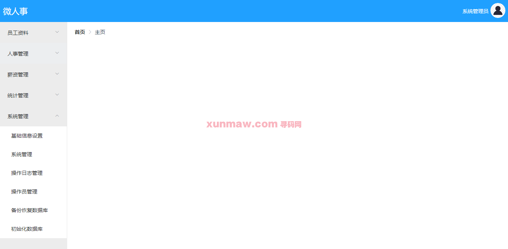
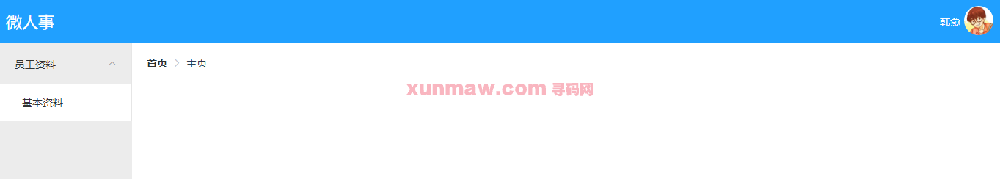
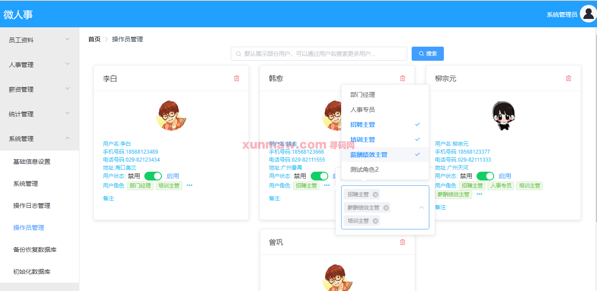
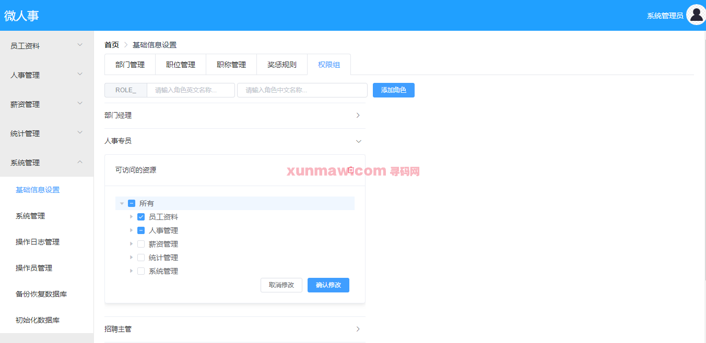

# 人事管理系统

 
#### 介绍
微人事是一个前后端分离的人力资源管理系统，项目采用 SpringBoot+Vue 开发，项目加入常见的企业级应用所涉及到的技术点，例如 Redis、RabbitMQ 等。  

#### 软件架构
后端架构：springboot | myabtis  
前端架构：vue   
系统环境：jdk1.8 | maven | mysql   

#### 功能介绍

##### 【功能详述】 
 1. 首先，不同的用户在登录成功之后，根据不同的角色，会看到不同的系统菜单，完整菜单如下：  

 2. 不同用户登录上来之后，可能看到的会有差异，如下：   

 3. 每个用户的角色是由系统管理员进行分配的，系统管理员给用户分配角色的页面如下：  

 4. 系统管理员也可以管理不同角色可以操作的资源，页面如下：  
  

#### 使用说明
1. 创建数据库，执行数据库脚本  
2. 修改jdbc数据库连接参数  
3. 下载安装maven依赖jar  
4. 启动springboot项目（后端） 

前端：
    cd ./vuehr目录
    安装依赖: npm install  
    运行项目：npm run build

请求地址：  
    http://localhost:8081/vhr   
    admin    
    123456  
